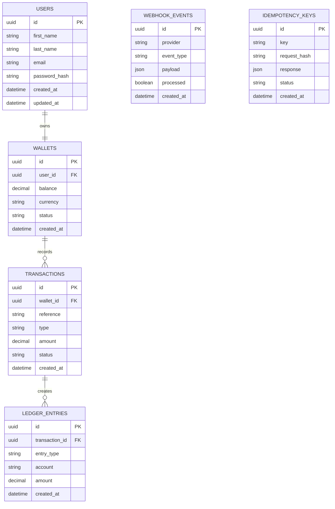

# Entity Relationship Diagram (ERD)

Version: 1.0

---

## Overview

This diagram represents the core database entities and relationships for the Payments API.

---

## Relationship Summary

- One User owns one Wallet.
- One Wallet can have many Transactions.
- One Transaction creates one or more Ledger Entries.
- Webhook Events update transaction status.
- Idempotency Keys prevent duplicate request processing.