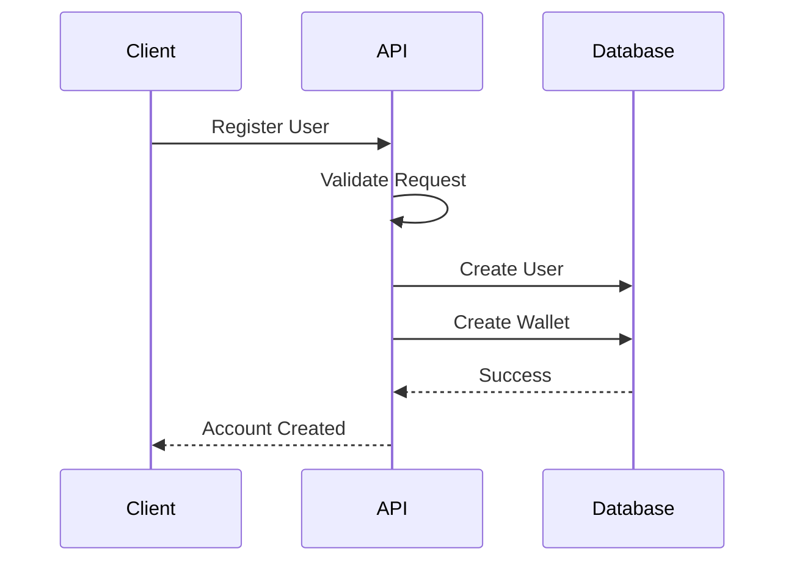
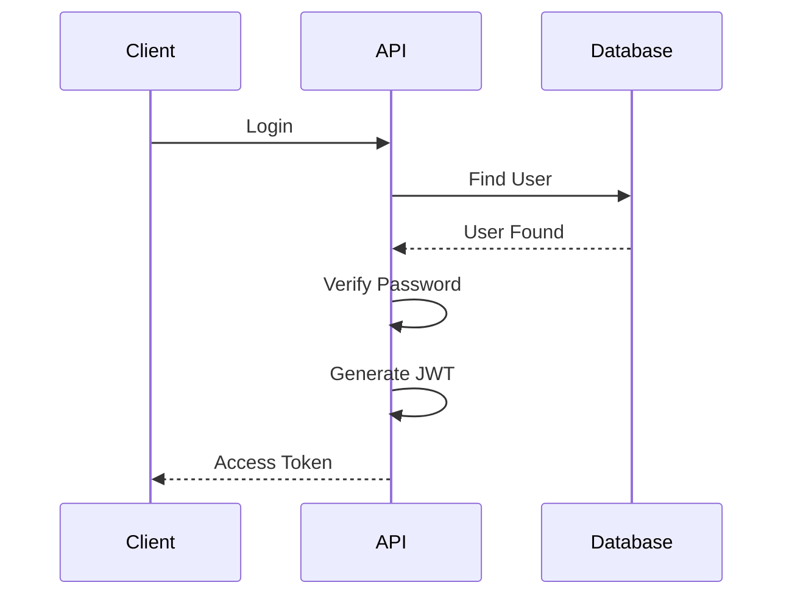
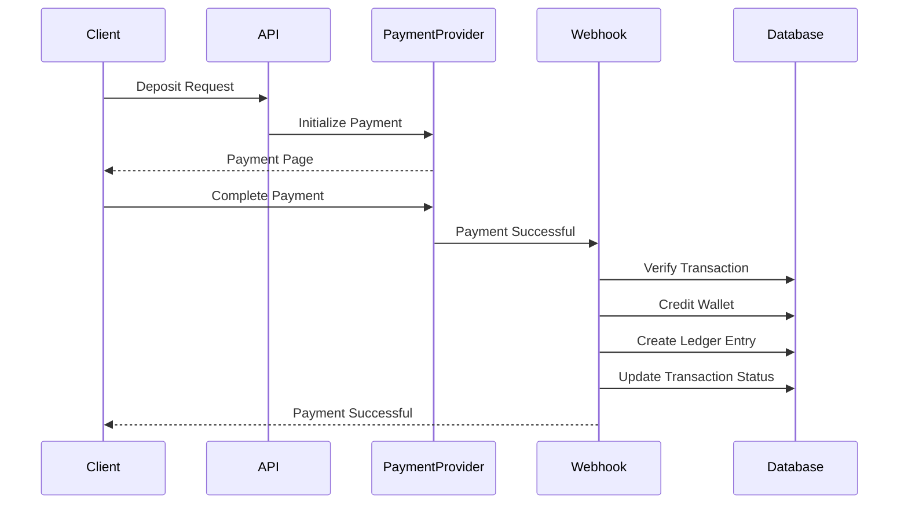
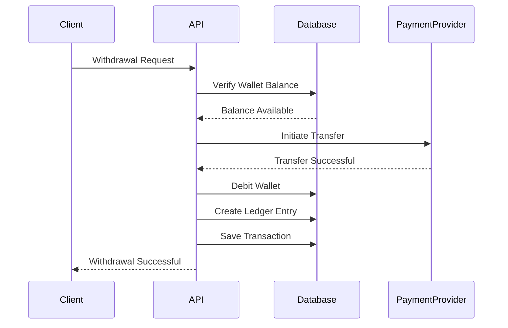
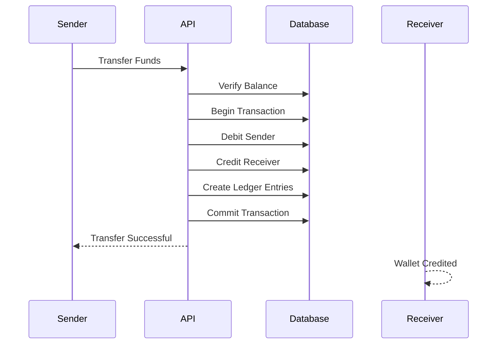
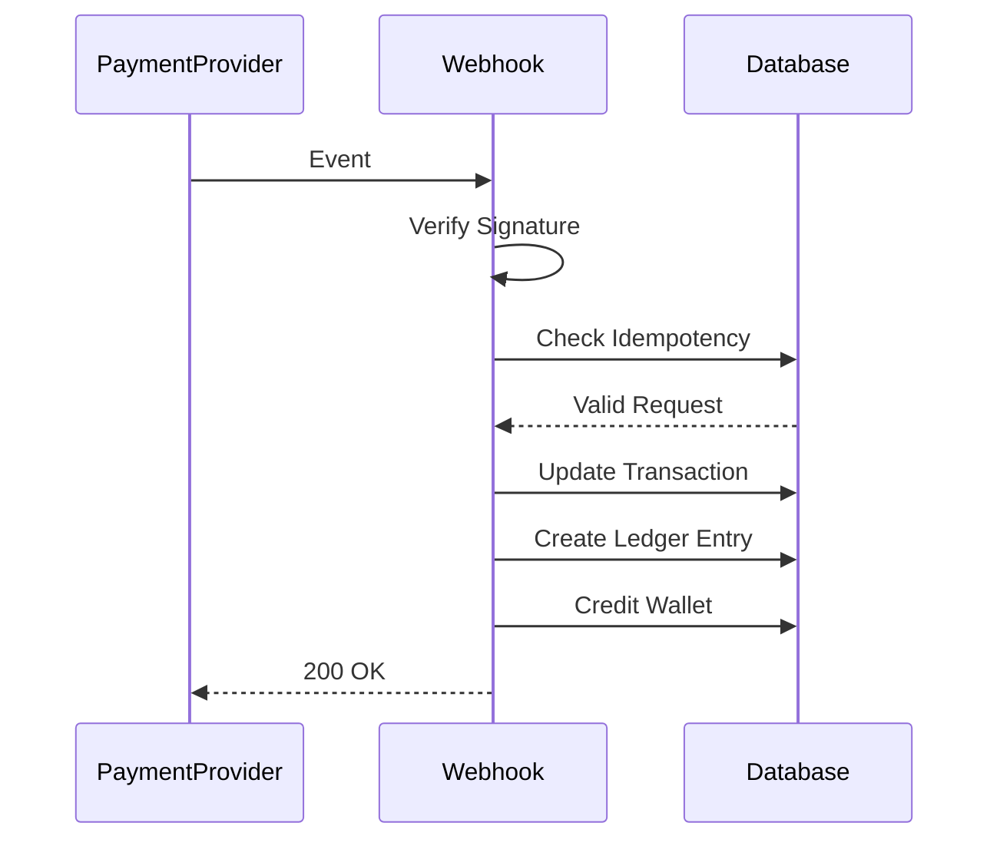

# System Flows

Version: 1.0

---

# Overview

This document describes the sequence of operations for the core business processes of the Payments API.

---

# User Registration

---

# User Login

---

# Deposit Flow

---

# Withdrawal Flow

---

# Wallet Transfer

---

# Webhook Processing

---

# Error Handling

## Failed Payment

- Transaction status becomes `FAILED`.
- Wallet balance remains unchanged.
- Ledger entries are not created.

---

## Duplicate Webhook

- Idempotency key is verified.
- Duplicate event is ignored.
- Existing response is returned.

---

## Insufficient Balance

- Withdrawal or transfer is rejected.
- Transaction status becomes `FAILED`.
- Wallet balance remains unchanged.